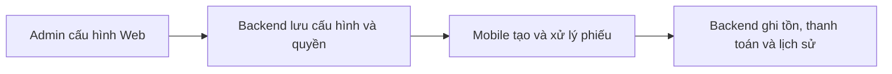

# DICA Web Admin

Web để admin cấu hình hệ thống DICA. Tạo phiếu, duyệt, giao nhận, kiểm kê, hoàn hàng, thanh toán và xem báo cáo nghiệp vụ được thực hiện trên mobile.

Web dùng Next.js, React và TypeScript; gọi API của `dica-backend`. Menu hiển thị theo quyền tài khoản; Backend kiểm tra quyền và phạm vi mỗi request.

## Admin cần làm gì?

| Thứ tự | Trang                      | Công việc                                                                               |
| ------ | -------------------------- | --------------------------------------------------------------------------------------- |
| 1      | Cơ sở & Chi nhánh          | Tạo cơ sở, điểm lưu kho, bộ phận và kho nhận mặc định.                                  |
| 2      | Nguyên liệu & Đơn vị       | Tạo đơn vị, nhóm, nguyên liệu, quy đổi, nhà cung cấp và hàng/giá của từng nhà cung cấp. |
| 3      | Nguồn hàng & hàng được xin | Chọn hàng bộ phận được xin và nguồn cấp từ kho hoặc nhà cung cấp.                       |
| 4      | Tài khoản & Phân quyền     | Tạo tài khoản, liên kết NCC, gán vai trò và phạm vi.                                    |
| 5      | Chính sách nghiệp vụ       | Đặt giá chuẩn, ngưỡng cảnh báo, thời hạn lưu ảnh và xác nhận thanh toán hai người.      |
| 6      | iPOS & định mức            | Cấu hình liên kết món, định mức và cảnh báo khi có dữ liệu phù hợp.                     |

Trang **Hướng dẫn quản trị** giải thích từng bước, có nút mở đúng tab và checklist trước khi dùng mobile. Không có tour tự chạy.



## Chạy local

Yêu cầu Node.js 24.15+ và Backend đã chạy. Backend mặc định dùng cổng `3000`, Web dùng `3001`.

1. Chạy `npm ci`.
2. Sao chép `.env.example` thành `.env.local`.
3. Đặt `NEXT_PUBLIC_API_URL=http://localhost:3000/api/v1` và `NEXT_PUBLIC_DEFAULT_ORGANIZATION_CODE` theo tổ chức đã bootstrap ở Backend.
4. Thêm `http://localhost:3001` vào `CORS_ORIGINS` của Backend.
5. Chạy `npm run dev -- --port 3001`, mở `http://localhost:3001` và đăng nhập bằng tài khoản đã được cấp quyền.

Web không tự tạo admin hoặc database. Các biến `NEXT_PUBLIC_*` được đưa vào client khi build; không đặt mật khẩu/secret trong đó.

## Kiểm tra và build

```bash
npm run lint
npm run typecheck
npm run build
npm run start -- --port 3001
```

Khi lỗi API, kiểm tra URL, Backend, CORS, mã tổ chức và quyền tài khoản. Không thấy menu/nút thao tác thường là thiếu quyền tương ứng.

## Deploy

Workflow `.github/workflows/ci-deploy.yml` kiểm tra pull request. Push vào `main` chạy kiểm tra, build image GHCR rồi deploy qua SSH nếu environment `production` và secret/variable đã cấu hình. Environment có thể yêu cầu duyệt deploy.

Web không chạy migration; migration và bootstrap quyền thuộc Backend. URL API/mã tổ chức production cần cấu hình trước khi build image Web.

## Quy tắc cần biết

- Ảnh chứng từ được tải qua API có xác thực, không dùng URL R2 public.
- Mở nội dung thông báo hoặc chọn đọc tất cả trên Web đánh dấu đã đọc cho cùng tài khoản, ảnh hưởng đến nhắc trên mobile.
- Dùng **Ngừng sử dụng** để giữ lịch sử. **Xóa dữ liệu vĩnh viễn** chỉ dành cho ADMIN, có xem phạm vi và mật khẩu xác nhận.
- iPOS chưa được xác nhận kết nối thật. Web hiện cấu hình mapping, định mức và cảnh báo.

## Tài liệu nghiệp vụ

Theo dõi phần đã hoàn thành và việc còn lại trong [TASK.md](TASK.md).

Tài liệu nằm trong repository Backend: [quyết định khách hàng](https://github.com/thangdevalone/dica-backend/blob/main/docs/customer-flow-questions-response.md), [review](https://github.com/thangdevalone/dica-backend/blob/main/docs/new-flow-implementation-review.md) và [contract mobile](https://github.com/thangdevalone/dica-backend/blob/main/docs/mobile-integration.md). Trong workspace, các file tương ứng nằm ở `dica-backend/docs`.

`new-flow.md` là mô tả ban đầu; khi khác nhau, ưu tiên câu trả lời khách ngày 08/10/2026. Workspace chưa có source mobile để xác nhận toàn bộ flow trên thiết bị.
